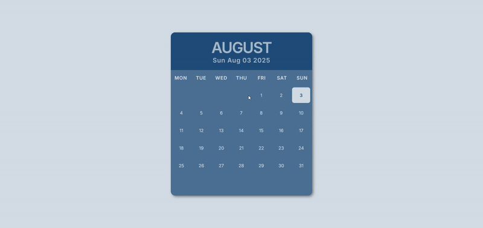
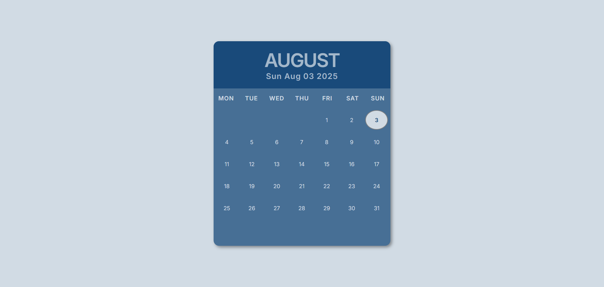

# 📅 ChronoCraft

**ChronoCraft** is a stylish, interactive calendar web app built with **HTML5**, **CSS3**, and **JavaScript**. Developed as a **college project**, it features a responsive layout, intuitive date navigation, and smooth hover effects to enhance user interaction.

- 
👨‍💻 Author
Virendra D. Verma
<a href="https://www.linkedin.com/in/dharmendraverma95/" target="_blank">🧑‍💻 LinkedIn Profile </a> | <a href="https://www.behance.net/dhirukumar" target="_blank">🧑‍💻 Behance Profile </a>

- 

---

## ✨ Features

- 📆 Responsive monthly calendar layout
- 🎯 Highlight current date
- 👆 Hover effects on date cells
- 📝 Add visual feedback or event placeholders (optional feature)
- 💻 Built with only HTML, CSS, and vanilla JavaScript
- 🌐 Works across modern browsers and screen sizes

---

## 🛠️ Technologies Used

- **HTML5** – semantic structure
- **CSS3** – layout, grid system, transitions, and hover effects
- **JavaScript** – dynamic date handling and calendar generation

---

## 📁 Folder Structure

chronocraft/
├── index.html
├── style.css
├── main.js
└── README.md

## 🎓 About the Project
This project was created as part of a college-level front-end development course, aimed at demonstrating core skills in layout design, interactivity, and clean UI/UX practices.

👉 Desktop Design 

👉 Desktop Design 
